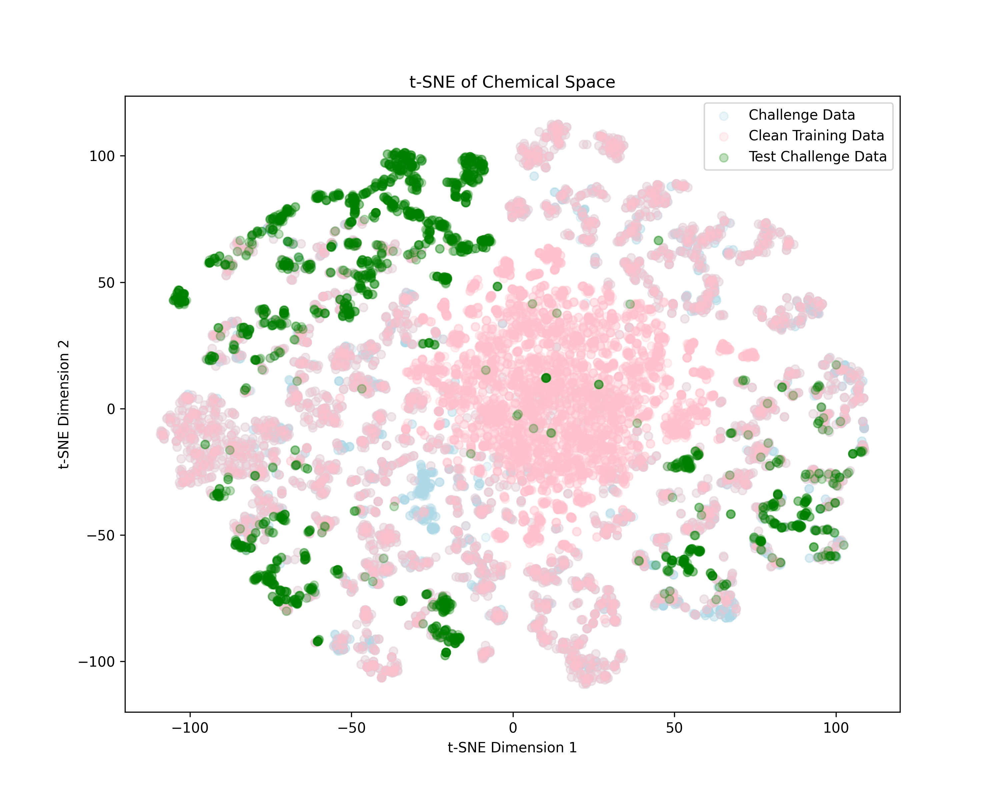

# OpenADMET-ExpansionRx Chellange Repo

Here I’d like to share the scripts I used to create my final submission for the challenge.
I submitted under the name “temal” and placed 10th overall in the final challenge evaluation, and 6th among models that rely only on open-source data. You can find the final results [here](https://openadmet.ghost.io/the-openadmet-expansionrx-blind-challenge-has-come-to-an-end/) at the bottom of the page.

## Datasets

These additional datasets were used:

1. [Fang et al.](https://pubs.acs.org/doi/10.1021/acs.jcim.3c00160)
2. [LogD7.4](https://github.com/nanxstats/logd74)
3. [LogD MoleculeNet](https://moleculenet.org/datasets-1)
4. [novartis_tdi](https://pubs.acs.org/doi/abs/10.1021/acs.molpharmaceut.2c00962)
5. [Caco-2 Permeability](https://pubs.acs.org/doi/10.1021/acs.molpharmaceut.4c00946)

Dataset sanitization included the removal of metals, duplicate SMILES, SMILES canonicalization, and the removal of salts. After preparing each dataset individually, they were concatenated into a single DataFrame. A subsequent aggregation step combined different endpoints for the same molecule into a single row. When multiple conflicting values were present for the same molecule, all of those values were set to NaN.

All endpoints from the additional datasets were modeled as separate heads, except for Fang HLM CLint, which was combined with the main challenge task.

## Training & Predictions

Five different models were trained five times each, resulting in a 25-model ensemble, using a 90/10 train/validation split. For every trained model and each challenge prediction head, I saved the checkpoint with the best validation loss (MAE). Splits were created using stratified sampling because the prediction heads differed in the amount of available data.

Final predictions were obtained via a weighted average over all ensemble models, with weights based on each model’s best validation loss. This allowed me to both approximate a prediction distribution and incorporate model uncertainty in a straightforward way.

### Chemical space

I noticed that a large portion of the blind test challenge data lies in the top-left region of the t-SNE plot, with very few or no training data points in between. I would expect this to make predictions particularly difficult, as also many activity cliffs appear to be present for each endpoint.

